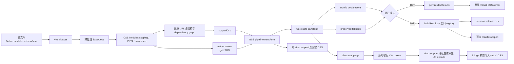

# GSS Vite Adapter 工作原理

## 文档定位

本文从 `packages/vite` 的插件入口出发，解释 GSS 如何接入 Vite 6 原生 CSS Modules 管线，重点覆盖：

- 插件在 Vite 管线中的具体生效位置；
- scoped CSS、CSS Modules tokens、atomic declaration 和 fallback CSS 的流转；
- build 与 dev 使用的不同状态模型；
- HMR、资源引用、manifest、report 和 devtools 的生成方式；
- 当前实现为了保证 CSS 正确性而保留的边界。

当前真实实现以 `packages/vite/src/plugin.ts` 和 Phase 5 原生管线方案为准。Phase 3 tracking 前半部分保留了
Route B、手动 `preprocessCSS` Route A 等历史记录，不应把这些历史线路视为当前行为。

## 核心结论

GSS 不自行编译 CSS Modules。它让 Vite 完成预处理、CSS Modules scoping、tokens、资源解析和依赖图管理，
然后在 Vite 原生 CSS 管线中途截获这些结果：

1. 把可以证明安全的 declaration 转成 atomic class；
2. 把复杂 selector、custom property、资源 class 等内容保留为 scoped fallback CSS；
3. 在 Vite 即将生成 CSS Module JS exports 前，原地增强原生 tokens；
4. 使用共享 CSS owner 或 build asset 输出 atomic CSS 与 fallback CSS。

业务代码仍然使用：

```tsx
<div className={styles.button} />
```

但 `styles.button` 的运行时值会从：

```txt
Button_button__abc
```

扩展为：

```txt
Button_button__abc _color_red _padding_12px
```

默认不会删除 `Button_button__abc`。这个 semantic scoped class 继续承载 fallback、custom property、资源和
复杂 selector 等不能安全 atomic 化的语义。

## 整体生效线路



## 两个 Vite 插件的分工

入口 `semanticAtomicCss()` 位于 `packages/vite/src/plugin.ts`。它返回的是两个 Vite plugin，而不是一个：

1. `semantic-atomic-css:vite-pipeline`
2. `semantic-atomic-css:vite-bridge`

最终顺序必须是：

```txt
vite:css
  < semantic-atomic-css:vite-pipeline
  < vite:css-post
  < semantic-atomic-css:vite-bridge
```

`configResolved` 会调用 `validateNativePipelineOrder()` 校验这个顺序，不满足就直接失败。

这个位置非常关键：

- 在 GSS 之前，Vite 已经把 SCSS/Less 编译成标准 CSS；
- 已经完成 CSS Modules scoped class；
- 已经处理 `composes`、`:import`、`:export`、`@value`；
- 已经建立预处理器 partial 和资源的 dependency graph；
- 但 `vite:css-post` 还没有最终生成 CSS Module 的 JS export 和 CSS 注入代码；
- 因此 GSS 仍来得及原地修改 tokens。

pipeline plugin 负责消费 scoped CSS、调用 core、增强 tokens 和登记 dev/build 结果。bridge plugin 使用
`enforce: 'post'`，只在 dev 中给 Vite 生成的 CSS Module JS 前置共享 virtual CSS import。

## 插件内部状态

插件 factory 闭包中保存以下状态：

| 状态 | 内容 | 生命周期与用途 |
| --- | --- | --- |
| `nativeTokensById` | Vite `getJSON` 捕获的 token 对象 | 临时连接 `vite:css` 和 GSS transform |
| `buildResults` | 每个模块的完整转换结果 | 当前 build 使用，最终生成 CSS、report |
| `devResults` | 当前仍然有效的 per-file 转换快照 | 可以在 HMR 时删除和替换 |
| `buildTransformer` | 带全局 atomic registry 的 core transformer | build 跨文件复用、manifest/report 聚合 |
| `pendingDevTransforms` | 正在运行的 dev transform Promise | virtual CSS/report 读取前短暂等待 |
| `devTransformGenerations` | 每个文件的失效代次 | 阻止旧异步 transform 回写新状态 |
| `warnedDiagnostics` | 已输出过的 warning key | 当前生命周期内避免重复 warning |
| `devTransformSession` | 整体 transform session 代次 | 防止跨生命周期的旧任务提交 |

这里最重要的设计区别是：

- build 使用 append-only 全局 registry；
- dev 使用可删除的 per-file 快照。

core 的 `createTransformer()` 只支持追加，不支持 `invalidate(id)`，所以它适合一次性 build，不适合直接作为
HMR 缓存。dev 必须在 adapter 层保存每个文件的当前快照。

## Vite 原生 tokens 的捕获

### 安装 `getJSON` 包装器

pipeline plugin 的 `config` hook 会通过 `createNativeCssModulesOptions()` 包装 Vite 的：

```ts
css.modules.getJSON
```

包装器会：

1. 保留并调用用户原有的 `getJSON`；
2. 把 Vite 产生的 token 对象放入 `nativeTokensById`；
3. 保留这个对象引用，稍后在 transform 中原地修改。

如果用户没有显式配置 GSS `modules`，就继承 Vite 的 `css.modules`。如果显式配置了 GSS `modules`，则只把
当前支持的配置覆盖回 Vite 原生管线。因此 `generateScopedName`、`localsConvention` 最终仍由 Vite 执行。

### token 不一定是 class

Vite tokens 可能包含：

```ts
{
  button: "Button_button__abc",
  composed: "Button_composed__abc Shared_base__xyz",
  spacing: "12px"
}
```

最后一个值可能来自 `:export` 或 `@value`，不是 DOM class。

GSS 会同时从两个方向收集证据：

- 遍历 token value 的空白片段；
- 用 selector AST 收集 `scopedCss` 中实际出现的 class。

只有两边都出现的字符串，才被认为可能进入 DOM。因此：

- `Button_button__abc` 可以参与 atomic 转换；
- `Shared_base__xyz` 可以通过 composed token 获得对应 atomic classes；
- `12px` 不会被误认为 class；
- scoped CSS 中存在、但 tokens 中没有的 global class 不会被错误 atomic 化。

## 单个 CSS Module 的 adapter 输入

pipeline transform 收到的 `scopedCss` 已经是 Vite 编译结果，不是原始 `.scss` 或 `.less`。

每个模块会构造成：

```ts
type CompiledCssModule = {
  id: string
  sourceCss: string
  scopedCss: string
  tokens: Record<string, string>
}
```

字段含义如下：

- `id`：原模块路径，用于缓存、诊断和 source location；
- `sourceCss`：直接从文件系统读取的原始 CSS/SCSS/Less，主要用于追踪信息；
- `scopedCss`：Vite 原生管线输出的标准、已 scoped CSS，是 core 真正转换的输入；
- `tokens`：Vite 原生 CSS Modules tokens。

例如原始输入：

```css
.button {
  color: red;
}
```

Vite 可能交给 GSS：

```css
.Button_button__abc {
  color: red;
}
```

以及：

```ts
{
  button: "Button_button__abc"
}
```

此时 core 不需要理解 CSS Modules 的 local/global 规则。adapter 创建 identity scope：

```ts
resolveClassName(className) {
  return className
}
```

因为 selector 已经 scoped 完成。

## 资源 class 的整类保留

调用 core 前，adapter 会执行 `collectAssetPreserveClassNames()`。

它使用 PostCSS 和 `postcss-value-parser` 找出包含结构化 `url()` 的 declaration，例如：

```css
.hero {
  background: url("./mark.svg") no-repeat;
}
```

这种 class 不进入 atomic 路径，而是整个 class 保留。原因是：

- dev 中资源可能内联成 data URL；
- build 中可能还是 `__VITE_ASSET__...__` 占位符；
- 最终文件名直到 `generateBundle` 才能确定；
- 如果把这种不稳定值放进 atomic key，dev/build class 名和复用关系可能不同。

如果另一个 class 通过 `composes` 和资源 class 共现：

```css
.assetComposed {
  composes: hero;
}
```

adapter 会根据 Vite token value 扩展传递闭包，把 composed class 一起保留，避免同一 DOM token 中出现半保留、
半 atomic 的不可控 cascade。

这些 class 会得到：

```txt
preserved-class / asset-reference
```

诊断，而不是被报告为已完成 atomic 转换。

## Core safe transform

core 的主流水线从 `packages/core/src/engine/createTransformer.ts` 中的 `runTransform()` 开始。

### PostCSS 解析和 IR

输入首先被解析成 PostCSS AST，再转换成 core 自己的 IR：

```ts
type CssRuleRecord = {
  id: string
  order: number
  selector: string
  css: string
  declarations: DeclarationMeta[]
  context: CssTransformContext
  source?: SourceLocation
  hasNestedNodes: boolean
}
```

IR 层保留：

- selector；
- declaration 的 `prop`、`value`、`important`；
- 源码顺序；
- 行列位置；
- `media` / `supports` 条件上下文；
- 是否存在 nested node。

当前只有 `@media` 和 `@supports` 会进入结构化上下文。其他 at-rule 整块作为 `PreservedBlock` 保留。

### Selector 安全判断

selector 使用 `postcss-selector-parser` 分析。允许的 safe selector 是：

```css
.button
.button:hover
.button:focus
.button:active
.button:disabled
.button:focus-visible
```

要求：

- 恰好一个 local/scoped class；
- 没有 tag、id、attribute；
- 没有 combinator；
- 没有额外 class；
- 没有 pseudo element；
- 没有 `:global`；
- 最多一个受支持的 pseudo class。

以下 selector 会整体进入 fallback：

```css
.card .title {}
.card > .title {}
button.primary {}
.button[data-state="open"] {}
.button::before {}
.button:hover:focus {}
:global(.external) {}
```

fallback 使用的是 Vite 已经 scoped 的 selector，因此 core 不需要重新实现 CSS Modules scoping。

### Declaration 安全判断

当前 declaration 策略为：

- 普通有效 declaration 可以 atomic；
- CSS custom property declaration 保留；
- 空 prop/value 保留；
- 使用 `var(...)` 的普通属性仍然可以 atomic。

例如：

```css
.card {
  --accent: #0f766e;
  color: var(--accent);
}
```

会拆成：

```css
/* preserved */
.Scoped_card {
  --accent: #0f766e;
}

/* atomic */
._color_var_accent {
  color: var(--accent);
}
```

semantic scoped class 仍在 token 中，因此 custom property 仍然能作用到元素上。

### Atomic key

每个 declaration 的 identity 由以下字段共同决定：

```ts
{
  prop,
  value,
  important,
  pseudo,
  media,
  supports
}
```

这意味着下面四种情况是四个不同的 atomic key：

```css
color: red;
color: red !important;
.button:hover { color: red; }
@media (...) { .button { color: red; } }
```

source file、source class 和源码位置不进入 key，所以相同 declaration 可以跨文件复用。

### Registry 与 class mapping

`AtomicRegistry.register()` 根据 key 执行：

- key 已存在：复用原 class，并把当前位置追加进 `sources`；
- key 不存在：生成 readable 或 hash class；
- class name 碰撞：追加由 key 派生的稳定 hash suffix。

单个 semantic class 最后形成：

```ts
{
  sourceClassName: "Button_button__abc",
  resolvedClassName: "Button_button__abc",
  atomicClassNames: ["_color_red", "_padding_12px"],
  suggestedClassName:
    "Button_button__abc _color_red _padding_12px",
  unsafeReasons: undefined
}
```

这里 mapping 的 key 是 Vite 已经 scoped 的 class，而不是最初源码中的 `button`。

## Tokens 增强

core 返回 class mappings 后，adapter 执行 `augmentCssModuleTokens()`。

假设 Vite token 是：

```ts
{
  button: "Button_button__abc",
  composed: "Button_composed__abc Shared_base__xyz",
  exportedValue: "12px"
}
```

core mappings 是：

```ts
{
  Button_button__abc: {
    atomicClassNames: ["_color_red", "_padding_12px"]
  },
  Shared_base__xyz: {
    atomicClassNames: ["_display_flex"]
  }
}
```

增强后：

```ts
{
  button:
    "Button_button__abc _color_red _padding_12px",

  composed:
    "Button_composed__abc Shared_base__xyz _display_flex",

  exportedValue:
    "12px"
}
```

pipeline transform 随后执行：

```ts
Object.assign(tokens, result.tokens)
```

这会原地修改 Vite 捕获的 token 对象。最后 pipeline 向 `vite:css-post` 返回：

```ts
{ code: '', map: null }
```

它同时产生两个效果：

- `vite:css-post` 仍然根据被增强的 token 对象生成原生 JS exports；
- 原来的 scoped CSS 不会再被 Vite 重复注入或提取。

因此 GSS 不生成第二套 CSS Module JS，只修改 Vite 即将使用的数据。

## Build 模式

### 生命周期初始化

`buildStart` 会：

- 清空 `buildResults`；
- 清空临时 tokens；
- 推进 transform session；
- 清空 generation 和 warning 去重状态；
- 创建新的 append-only `buildTransformer`。

每个模块转换后同时进入两个位置：

```txt
buildTransformer
  └─ 全局 AtomicRegistry、聚合 manifest/report

buildResults[id]
  └─ 当前模块的 sourceCss、scopedCss、tokens、TransformCssResult
```

两者职责不同：

- transformer 提供跨文件复用统计和聚合治理数据；
- `buildResults` 保留每个模块的完整快照，便于稳定重排、fallback 拼接和 analyzer 分析。

### 最终 CSS 聚合

最终 CSS 不依赖异步 transform 的完成顺序。adapter 会：

1. 按规范化 source id 排序 `buildResults`；
2. 遍历模块的 `transform.atomic`；
3. 按 atomic key 全局去重；
4. 将无条件 atomic rule 放在前面；
5. 将 `@media` / `@supports` rule 放在后面；
6. 对简单宽度断点调整覆盖顺序；
7. 最后按模块稳定顺序拼接 preserved CSS。

简单宽度断点的当前顺序是：

- `max-width` 从大到小；
- `min-width` 从小到大。

这个顺序属于当前 cascade 正确性模型，不是单纯的格式化。

### 资源解析与产物

直到 `generateBundle`，GSS 才调用 Rollup `getFileName()` 把：

```txt
__VITE_ASSET__referenceId__
```

转换为最终 URL。

随后默认输出：

```txt
assets/semantic-atomic.css
```

按配置还可以输出：

```txt
semantic-atomic-manifest.json
semantic-atomic-report.json
```

report 会额外调用 analyzer，生成：

- health：`ready` / `risky` / `blocked`；
- unsafe reason 分布；
- preserved CSS 比例；
- 高风险文件；
- atomic 复用率；
- declaration conflict；
- raw/gzip/brotli 体积估算。

最后 GSS 把 `semantic-atomic.css` 的 `<link>` 注入所有 HTML。普通全局 CSS 仍由 Vite 自己输出，所以 build
HTML 可能同时拥有：

```html
<link rel="stylesheet" href="/assets/index-xxx.css">
<link rel="stylesheet" href="assets/semantic-atomic.css">
```

## Dev 模式

dev 不能使用 build 的 append-only transformer，因为 HMR 必须能够删除旧模块结果。

因此每次模块转换使用无状态的 `transformCss()`：

```txt
模块 A -> 独立 TransformCssResult
模块 B -> 独立 TransformCssResult
模块 C -> 独立 TransformCssResult
```

它们存入：

```ts
devResults: Map<file, CssModuleTransformResult>
```

### 共享 CSS owner

所有 CSS Module JS 都由 bridge 前置：

```js
import "virtual:semantic-atomic-css/dev.css";
```

virtual module 加载时，从全部当前 `devResults` 创建快照：

```txt
全部 per-file atomic
  -> 按 key 去重
  -> cascade 分区和排序

全部 per-file preserved
  -> 拼接

得到一份共享 CSS
```

virtual id 故意不是 `.module.css`，避免 Vite 把生成后的 atomic CSS 再执行一次 CSS Modules scoping。

共享 owner 解决了一个实际问题：如果每个 CSS Module 都注入自己的 atomic CSS，同一个 atomic class 会出现在
多个 style tag 中。后加载模块可能用重复的基础 declaration 覆盖先前模块中的状态或 media declaration。现在
同一个 atomic key 在全局只输出一次。

当 dev server 已经缓存 virtual CSS，而一个新的懒加载 CSS Module 首次出现时，GSS 会调用
`reloadModule()` 刷新共享 owner。

## HMR 与状态失效

当前实现不是 CSS-only HMR，而是保守的 full reload。

`handleHotUpdate` 会从 Vite module graph 找受影响 CSS Modules，并同时沿两个方向查找：

- dependency 方向：用于 JS/TS 删除 CSS import 时，利用更新前的 outgoing edge 找到旧 CSS；
- importer 方向：用于 Sass/Less partial 更新时，找到依赖这个 partial 的 CSS Module。

对每个受影响文件执行：

```txt
删除 devResults[file]
删除 nativeTokensById[file]
增加 devTransformGenerations[file]
失效 CSS Module graph node
失效 virtual CSS node
发送 full-reload
```

### Generation 防止旧异步结果回写

考虑下面的时序：

```txt
generation 2 transform 开始
→ 文件再次变化
→ generation 增加到 3
→ generation 2 transform 才完成
```

没有保护时，旧结果可能在新结果之后写回 `devResults`。

现在 transform 提交前会比较：

```ts
capturedGeneration === currentGeneration
```

不相等时：

- 不写 `devResults`；
- 不修改 tokens；
- 不输出旧 diagnostics；
- 直接返回空 CSS。

### Pending transform 与快照一致性

virtual CSS 和 dev report 在读取前会等待当前 `pendingDevTransforms` 短暂排空。

最大等待约一秒。超时后使用当时已经提交的快照，而不是无限阻塞。这个 deadline 是当前 dev 一致性模型的
明确限制。

## Dev report 与 overlay

`devResults` 可以删除模块，但 core transformer 不能删除。因此 report API 不能长期复用一个 transformer，
否则已经删除的 CSS 会残留在 manifest/report 中。

每次请求：

```http
GET /__semantic-atomic-css/report
```

都会：

1. 等待当前 transform 短暂稳定；
2. 创建一个新的临时 transformer；
3. 按稳定 source id 重放当前 `devResults`；
4. 用当前浏览器实际消费的共享 dev CSS 执行 analyzer；
5. 包装为 `schemaVersion: 1` 的 Vite dev envelope。

所以 dev report 是“当前有效快照”，不是历史累计数据。

启用 overlay 时，adapter 会在 dev HTML 中注入 browser runtime。overlay 使用 Shadow DOM 隔离自身样式并轮询
同源 report API；它只展示 report，不参与 CSS 转换。

## 真实 fixture 产物

现有 preprocessor fixture 的 JS 中，tokens 已经变成类似：

```js
const shell =
  "fixture_Base-module__shell _004133rz _00hez00m _011xl66x _00rsh6q9";
```

其中：

- `fixture_Base-module__shell` 是 Vite scoped semantic class；
- 后面的 `_004133rz` 等是 GSS build hash atomic class。

对应 CSS 中：

```css
._004133rz {
  display: grid;
}
```

资源相关 class 没有 atomic 化：

```css
.fixture_Theme-module__hero {
  color: #0f766e;
  background: #ccfbf1 url("/assets/fixture-mark-CZHB4dzu.svg") no-repeat right 12px center;
  padding: 14px;
  border: 2px solid #5eead4;
}
```

可以直接检查以下真实产物：

- `fixtures/vite-css-modules/dist/preprocessor/semantic/assets/semantic-atomic.css`
- `fixtures/vite-css-modules/dist/preprocessor/semantic/semantic-atomic-manifest.json`
- `fixtures/vite-css-modules/dist/preprocessor/semantic/semantic-atomic-report.json`
- `fixtures/vite-css-modules/dist/preprocessor/semantic/index.html`

manifest 中 `_004133rz` 的 `sources` 包含 CSS 与 Less 文件的位置，证明 `display: grid` 跨文件复用了同一个
atomic declaration。

## 当前安全边界

GSS 当前主动拒绝或保守处理以下场景：

- 只接管 `.module.css`、`.module.scss`、`.module.less`；
- 普通全局 CSS 继续走 Vite 原生管线；
- 不自行实现 Sass/Less；
- 不自行实现 CSS Modules scoping；
- 不改写 JSX/TSX；
- 默认保留 semantic scoped class；
- unsafe selector 必须保留并产生诊断；
- custom property declaration 保留；
- named exports、strict mode、Lightning CSS fail fast；
- 拿不到 Vite native tokens 时直接终止，避免生成 CSS 但 DOM token 没被增强；
- 资源 URL 无法通过公开 API 可靠还原时 fail fast；
- dev 使用 full reload，不承诺 CSS-only HMR。

这些边界共同体现当前实现的核心原则：无法证明安全等价时，降低 atomization rate，保留原 scoped CSS，并
提供可追踪的 warning/report，而不是冒险改变 cascade 或产生 silent miscompile。

## 关键源码索引

- `packages/vite/src/plugin.ts`：插件组合、Vite hooks、dev/build 状态、CSS 聚合、HMR、report 与 HTML 注入；
- `packages/vite/src/cssModules.ts`：原生 tokens 捕获、export evidence、identity scope 和 token 增强；
- `packages/vite/src/assetReferences.ts`：资源 class 保留、composes 闭包和 build URL 解析；
- `packages/vite/src/options.ts`：配置默认值和归一化；
- `packages/core/src/engine/createTransformer.ts`：core transform pipeline 与 append-only registry 生命周期；
- `packages/core/src/ast/collectIr.ts`：PostCSS AST 到 core IR；
- `packages/core/src/selector/analyzeSelector.ts`：safe selector 判定；
- `packages/core/src/declaration/analyzeDeclaration.ts`：declaration 判定；
- `packages/core/src/atomizer/createAtomicKey.ts`：atomic key；
- `packages/core/src/registry/AtomicRegistry.ts`：跨声明复用、class name 和 sources；
- `packages/core/src/registry/ClassMappingBuilder.ts`：semantic class 到 atomic classes 的映射；
- `docs/phase-5-css-modules-preprocessor-plan.md`：当前 Vite 原生 CSS 管线设计；
- `docs/phase-5-css-modules-preprocessor-acceptance.md`：CSS/SCSS/Less、资源和 visual/HMR 验收范围。
